# **Group Project**

## Abdullah Al Amin, Muhammad Talha Ahmad, Ugwuegbu Prince Chibueze

## Big Data Database Development

## Dr. Amina Souag

## 16-05-2022

<br/>
<br/>

# **A. Database manipulation**

## Create a new database named ‘DBLP TEST’

The databse name should be a single word. So, an underscore can be used to join the DBLP and TEST.

```javascript
use DBLP_TEST
```

It will create and switch the current db to "DBLP_TEST"

## Create a new collection named ‘publis’

```javascript
db.createCollection("publis", { capped: true, size: 5242880, max: 5000 })
```

> Capped: The collection is fixed-size that support high-throughput operations that insert and retrieve documents based on insertion order.

> Size: The collection can have max size

> Max: The collection can have max documents

## Create a new Json document

```javascript
{
  "type": "Book",
  "title": "Modern Database Systems: The Object Model, Interoperability, and Beyond.",
  "year": 1995,
  "publisher": "ACM Press and Addison-Wesley",
  "authors": ["Won Kim"],
  "source": "DBLP"
}
```

## Insert the new document into the collection "publis"

```javascript
db.publis.insertOne({
  type: "Book",
  title:
    "Modern Database Systems: The Object Model, Interoperability, and Beyond.",
  year: 1995,
  publisher: "ACM Press and Addison-Wesley",
  authors: ["Won Kim"],
  source: "DBLP",
})
```

## Create two other documents of type "Article" (and insert them into "publis")

```javascript
db.publis.insertMany([
  {
    type: "Article",
    title:
      "From high-integrity embedded systems to resiliant autonomous cyber-physical systems",
    year: 2022,
    publisher: "University of Paris-Saclay",
    authors: ["Daniela Cancila"],
    source: "DBLP",
  },
  {
    type: "Article",
    title: "Principled methods for mixtures processing",
    year: 2022,
    publisher: "University of Montpellier",
    authors: ["Antoine Liutkus"],
    source: "DBLP",
  },
])
```

## Consult the content of the collection ‘publis’ and show your two new inserted documents

```javascript
db.publis.find({})
```

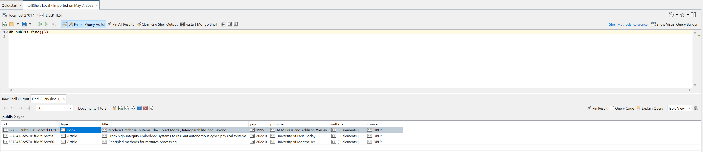

# **B. Database import and query**

## Import the database collection

```javascript
mongoimport --db "DBLP_TEST" --collection books C:\Users\Invalid\Downloads\Compressed\dblp.json
```

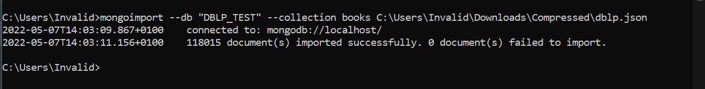

## List of all books

```javascript
db.books.find({})
```

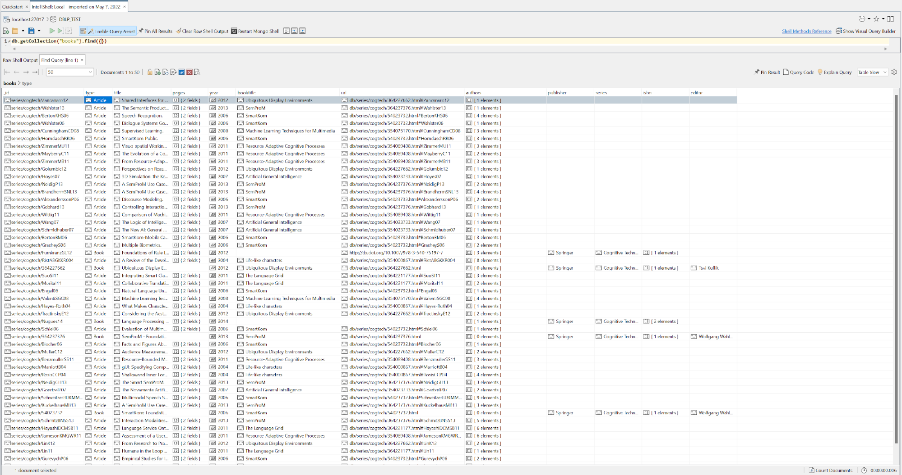

## List of publications since 2012

```javascript
db.books.find({ year: { $gte: 2012 } })
```

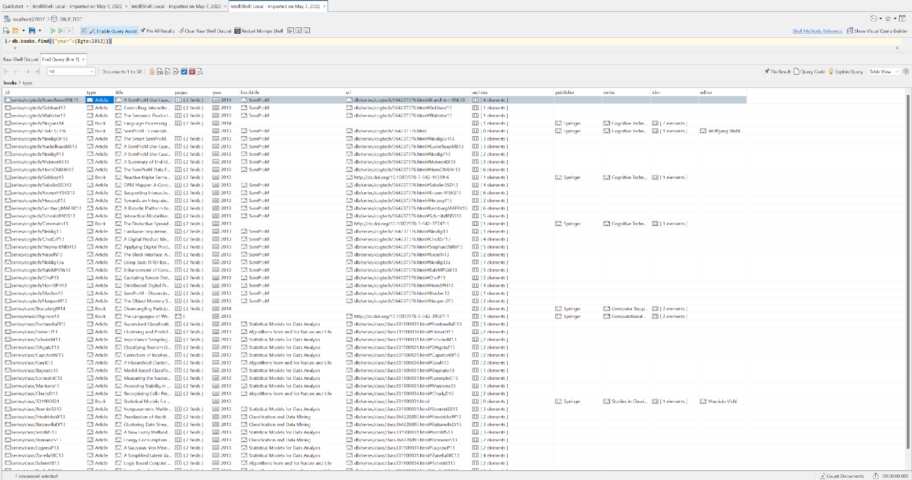

## List of publications by the author "Massimo Zancanaro"

```javascript
db.books.find({ authors: "Massimo Zancanaro" })
```

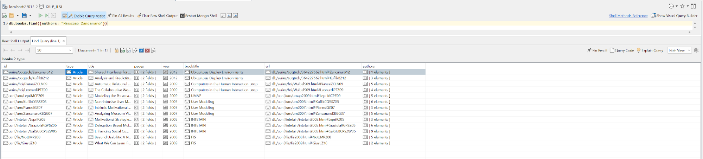

## Count the number of "Massimo Zancanaro" publications

```javascript
db.books.find({ authors: "Massimo Zancanaro" }).count()
```

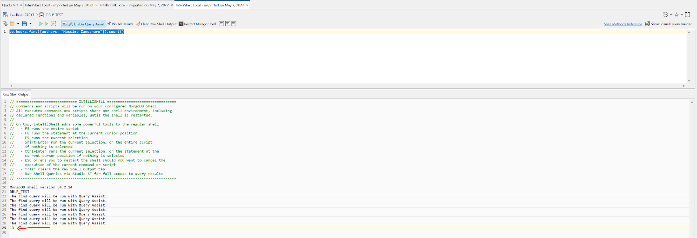

## Sort "Massimo Zancanaro" publications by book title and start page

```javascript
db.books
  .find({ authors: "Massimo Zancanaro" })
  .sort({ booktitle: 1, "pages.start": 1 })
```

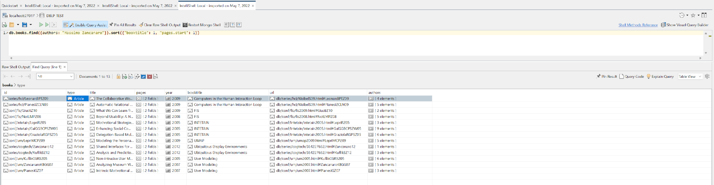

## List of all distinct publishers

```javascript
db.books.distinct("publisher")
```

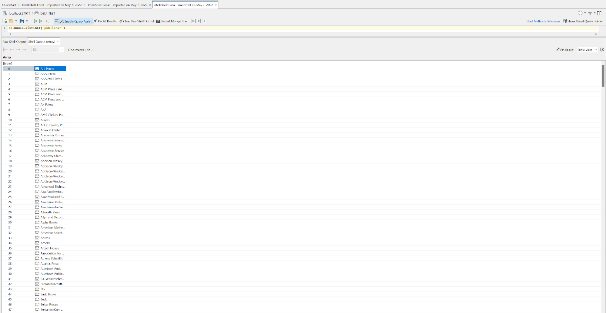

## List of all publications which title contains the word "database" (Case insensitive)

```javascript
db.books.find({ title: { $regex: /.*database.*/, $options: "i" } })
```

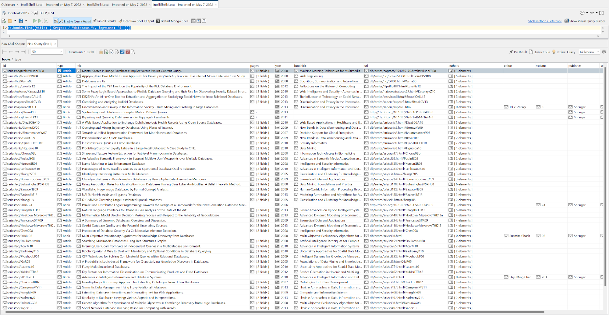

# **C. Research: Map/Reduce**

- Map Reduce

Use

```javascript
db.books.mapReduce(
  function () {
    emit(this.year, 1)
  },
  function (key, values) {
    return Array.sum(values)
  },
  { query: {}, out: "total_publications_by_year" }
)
```

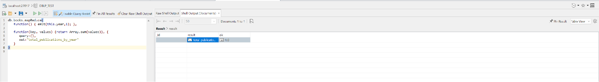

Result

```javascript
db.total_publications_by_year.find({})
```

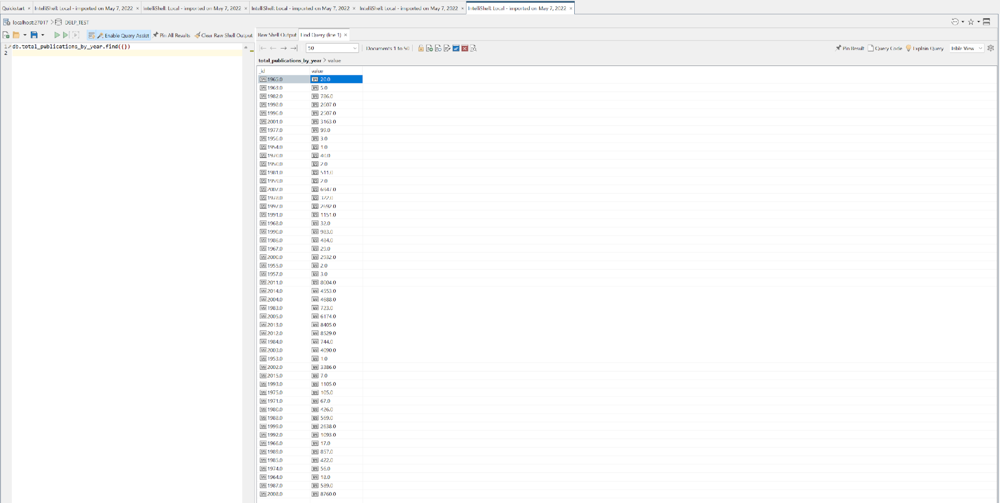

- Aggregation

```javascript
db.books.aggregate([
  {
    $group: {
      _id: "$year",
      docs: {
        $push: "$$ROOT.type",
      },
    },
  },
  {
    $project: {
      _id: false,
      year: "$_id",
      books: {
        $reduce: {
          input: "$docs",
          initialValue: 0,
          in: {
            $add: [
              "$$value",
              {
                $cond: [
                  {
                    $eq: ["$$this", "Book"],
                  },
                  1,
                  0,
                ],
              },
            ],
          },
        },
      },
      articles: {
        $reduce: {
          input: "$docs",
          initialValue: 0,
          in: {
            $add: [
              "$$value",
              {
                $cond: [
                  {
                    $eq: ["$$this", "Article"],
                  },
                  1,
                  0,
                ],
              },
            ],
          },
        },
      },
    },
  },
  {
    $sort: {
      year: 1,
    },
  },
])
```

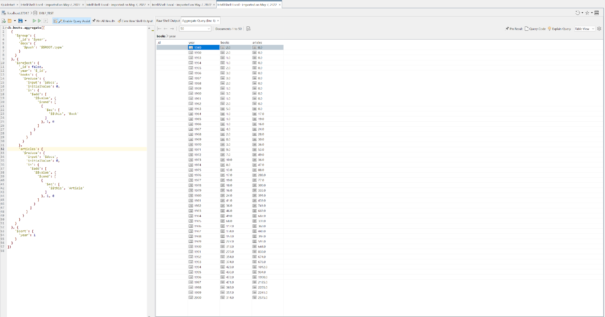
